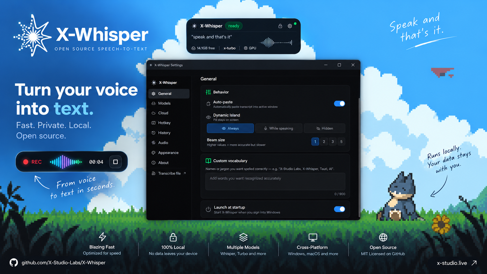

<p align="center">
  
</p>

<h1 align="center">X-Whisper</h1>

<p align="center">
  <strong>Open-source speech-to-text and voice dictation for Windows and macOS.</strong><br/>
  Press a hotkey, speak, and the text lands wherever your cursor is — transcribed locally by
  <a href="https://github.com/ggerganov/whisper.cpp">whisper.cpp</a>, shown in a Dynamic Island-style overlay.
</p>

<p align="center">
  <a href="https://github.com/X-Studio-Labs/X-Whisper/releases"></a>
  <a href="https://github.com/X-Studio-Labs/X-Whisper/actions/workflows/ci.yml"></a>
  
  <a href="LICENSE"></a>
  <a href="https://x-studio.live"></a>
</p>

---

## What it does

- **Hotkey → speak → pasted.** `Ctrl+Shift+Space` (`Cmd+Shift+Space` on macOS) toggles recording from any app. When you stop, the transcript is pasted into whatever has focus.
- **Runs on your machine.** Transcription uses [whisper.cpp](https://github.com/ggerganov/whisper.cpp) with CUDA, Vulkan, or Metal acceleration picked automatically — nothing leaves your computer unless you opt into cloud.
- **Live partials.** On GPU backends the island shows text while you're still talking.
- **Stays out of the way.** Keep the island always on, show it only while you speak, or hide it entirely — the hotkey works in every mode.
- **Transcribe files.** Drop an mp3 / wav / m4a / mp4 onto the Transcribe window; export as text or SRT.
- **Zero setup.** The installer bundles everything. On first launch the app downloads a managed Python runtime and the model your hardware can handle best — you never install Python or pick a model.
- **Optional cloud.** Paste your own [Groq](https://console.groq.com/keys) API key under Settings → Cloud to use `whisper-large-v3` / `-turbo` on Groq's hardware. Off by default.
- **No account, no telemetry, no phone-home.** There's nothing to sign up for.

## Models

| Model | Size | Languages | Runs on |
|---|---|---|---|
| X-Small EN | 466 MB | English | Any CPU |
| X-Medium EN | 1.4 GB | English | CPU / GPU |
| X-Turbo *(default)* | 1.6 GB | 99 | GPU recommended |
| X-Large v3 | 2.9 GB | 99 | GPU, ≥ 6 GB VRAM |
| X-Turbo Cloud | — | 99 | Groq (your key) |
| X-Pro Cloud | — | 99 | Groq (your key) |

The app probes your RAM / GPU at first run and picks a preset (Instant / Balanced / Accurate). You can change it any time under Settings → Models.

## Install

Grab the latest installer from the [Releases page](https://github.com/X-Studio-Labs/X-Whisper/releases):

- **Windows 10 / 11** — `X-Whisper_x.y.z_x64-setup.exe` (NSIS) or `.msi`
- **macOS 13+** — `X-Whisper_x.y.z_aarch64.dmg`

First launch takes a minute or two: it sets up the managed runtime and downloads the default model (~1.6 GB). After that it lives in your system tray / menu bar.

## Build from source

You need **Node 20+**, **Rust stable**, and (dev only) **Python 3.12**. Consumers never install Python — the shipped app bootstraps its own.

```bash
git clone https://github.com/X-Studio-Labs/X-Whisper.git
cd X-Whisper
npm install

# Fetch the whisper.cpp + ffmpeg binaries the app bundles (gitignored, ~350 MB)
pwsh build/fetch-whisper-cpp.ps1 && pwsh build/fetch-ffmpeg.ps1        # Windows: CPU + CUDA, ffmpeg
pwsh build/build-whisper-cpp-vulkan.ps1                                 # Windows: Vulkan (built from source — needs VS C++ tools, cmake, Vulkan SDK)
bash build/build-whisper-cpp-metal.sh && bash build/fetch-ffmpeg.sh   # macOS

npm run tauri dev      # dev loop — spawns Vite + the Python engine
npm run tauri build    # installer → src-tauri/target/release/bundle/
```

See [CONTRIBUTING.md](CONTRIBUTING.md) for the architecture walkthrough, how to run the engine on its own, and how to add a model or provider.

## How it's built

Three processes, one WebSocket:

```
┌──────────────────┐   spawn + Job Object   ┌───────────────────────┐
│  Rust / Tauri v2 │ ─────────────────────▶ │  Python engine        │
│  windows, tray,  │                        │  audio capture,       │
│  hotkey, paste   │                        │  whisper.cpp / Groq,  │
└────────┬─────────┘                        │  models, settings     │
         │ webviews                         └───────────┬───────────┘
         ▼                                              │ ws://localhost:9876
┌──────────────────┐                                    │
│  React + Zustand │ ◀──────────────────────────────────┘
│  island, settings│
│  onboarding, ... │
└──────────────────┘
```

| Layer | Stack |
|---|---|
| Shell | Tauri v2, Rust |
| UI | React 19, TypeScript, Tailwind, Framer Motion, Zustand |
| Engine | Python 3.12 (managed runtime), `websockets`, `sounddevice` |
| Local STT | whisper.cpp `whisper-cli` — CUDA / Vulkan / CPU on Windows, Metal on macOS |
| Cloud STT | Groq `whisper-large-v3`, `whisper-large-v3-turbo` (optional, your key) |

## Privacy

Audio is processed locally and discarded after transcription. Transcript history (last 50, optional) and settings live in `%APPDATA%\X-Whisper` / `~/Library/Application Support/X-Whisper`. If you add a Groq key, audio for *cloud* models is sent to Groq under [their terms](https://groq.com/privacy-policy/); the key itself is stored in the OS keyring, never in a plain file when a keyring is available.

## Contributing

Issues and PRs are welcome — read [CONTRIBUTING.md](CONTRIBUTING.md) first. Security reports go through [SECURITY.md](SECURITY.md).

## License

[MIT](LICENSE) © X-Studio.

The installer bundles two third-party programs as separate executables, invoked as subprocesses: [whisper.cpp](https://github.com/ggerganov/whisper.cpp) (MIT) and a prebuilt [FFmpeg](https://ffmpeg.org) binary (GPL — from [gyan.dev](https://www.gyan.dev/ffmpeg/builds/) on Windows, [evermeet.cx](https://evermeet.cx/ffmpeg/) on macOS). Their licenses apply to those binaries, not to X-Whisper's own code.

---

<p align="center">Built by <a href="https://x-studio.live">X-Studio</a></p>
